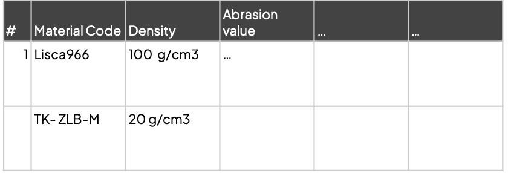
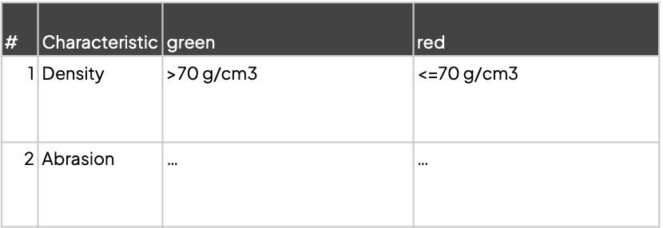
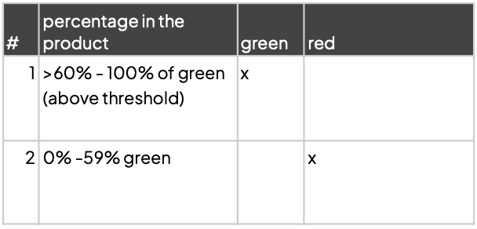
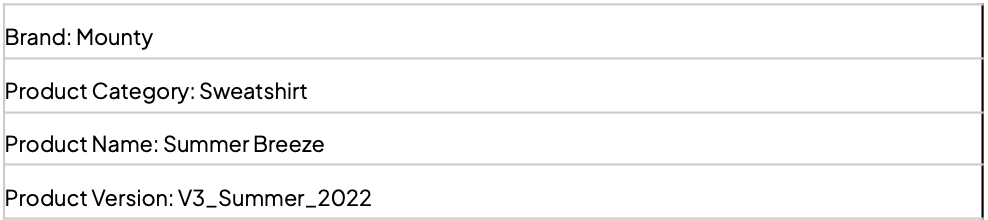
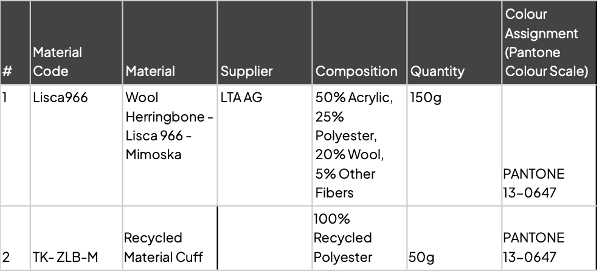
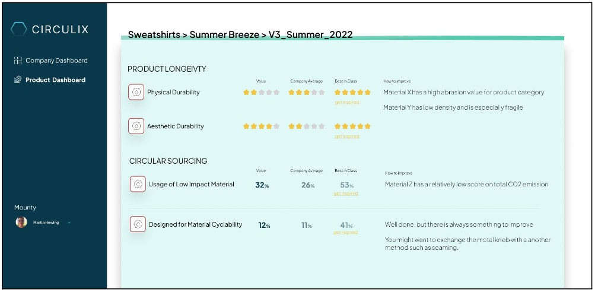

# circulix assignment

In this case study we would like to focus on the main functionality of the Circulix MVP, which is importing product data from clients (fashion brands), enriching this data with further data from the Circulix database and displaying a Circular KPI back to the client.

## about task

Material Database in Circulix with Durability Characteristics

Threshold Database of when a Physical Durability Characteristic is good or bad.

Material Mix and Durability Assessment Database (products can consist of different materials with a mix of “good” or “bad” durability values)

## Case: Analyzing the V3 Summer 2022 Version of the product

A designer from the brand would now provide Circulix with the Bill of Material data for each product, and would like to see how her product(s) performs on different circularity KPIs. She is interested especially in the KPI around Physical Durability. In the frontend application, when a designer of a brand logs in and her data of her product is uploaded into Circulix, the analysis of the version of the product is shown, such as:

- Different circularity KPIs
- The result of the assessment of the product on this KPI
- A comparison to the Average of the company
- A comparison to a Best-In-Class product from the industry
- A recommendation, how the KPI can be improved

The data from the brand could look like this:

## Bill of Material for the Product called SummerBreeze

Here is an example, how the frontend might look like:

## The task and interview

In the case study, we would like to discuss with you the way you address this problem from a technical point of view, this includes the architectural design, the way you store and query the data, the list of endpoints you define, the security measurements, the technologies you would use and the implementation steps.
Please write code based on the requirements we defined above and please clarify the assumptions you are taking and the reasons for these assumptions. The code could show a simple query of data needed to calculate physical durability (consisting of only the density) of the above item. The result could be shown in a simple “green, red”-logic based on the threshold values above. Please feel free to add ideas that come to your mind, that might increase the value of the analysis for the designer - also if that would be further down the roadmap. We would also be interested to hear how you test your code.
Also you are welcome to share any documents or diagrams during the interview that makes it easier to describe your ideas.
If you have any questions, feel free to ask us anytime before the interview or directly during the interview.
